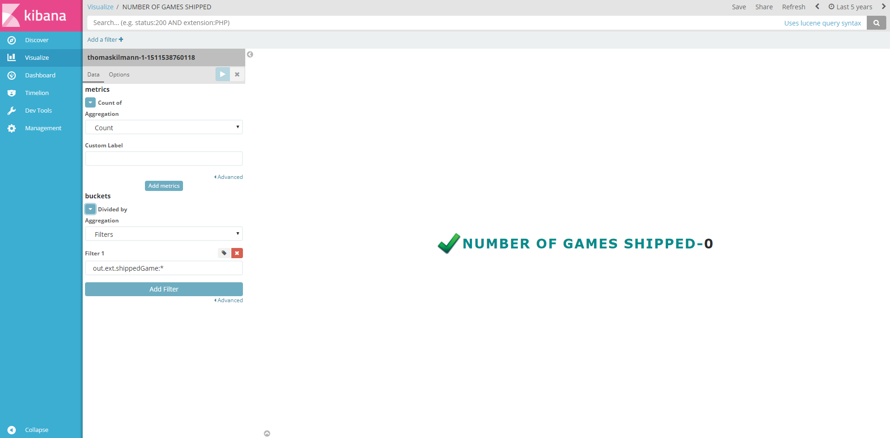

# Badges Visualizations Plugin for Kibana 5




### About
This is a plugin for Kibana5+. Has been developed and tested on Kibana 5.6.2.

### Usage
Installation steps (manual):
```
$ cd KIBANA_HOME/plugins
$ git clone https://github.com/e-ucm/badges-vis.git badges-vis
$ cd badges-vis
$ npm install
```
> **Note:** If you can not see the plugin in the plugin list, or get kibana warning like "**Plugin "badges-vis" was disabled because it expected Kibana version "5.6.3", and found "5.6.2" please modify package.json file and put your kibana version.

Through plugin installer
```
./bin/kibana-plugin install https://github.com/e-ucm/badges-vis/releases/download/5.6.2/kibana.zip
```

Unistall:
```
$ bin/kibana plugin  --remove badges-vis
```

### Contributions (Work in progress)
Anyone is welcome to contribute to my project. There are various ways you can contribute:

1. Raise an [Issue](https://github.com/e-ucm/badges-vis/issues) on GitHub
2. Send a Pull Request with your bug fixes and/or new features
